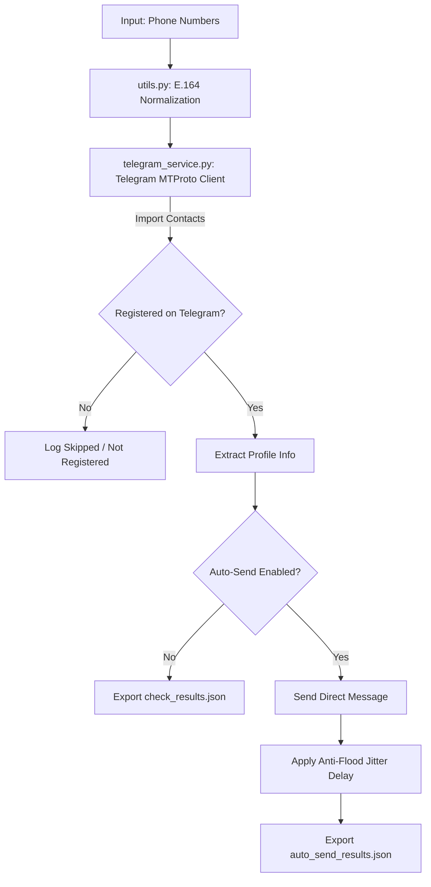

# 🚀 Telegram Phone Detection & Auto-Send Solution

A high-performance Python toolkit and Web Dashboard built on Telethon (MTProto API) to **detect Telegram account registration from phone numbers** and **automate direct messaging** with robust anti-spam / flood protection mechanisms.

---

## 📑 Table of Contents
- [Features](#-features)
- [Project Architecture](#-project-architecture)
- [Prerequisites](#-prerequisites)
- [Installation & Setup](#-installation--setup)
- [Configuration (.env)](#-configuration-env)
- [Usage Guide](#-usage-guide)
  - [1. Web UI Dashboard (Recommended)](#1-web-ui-dashboard-gradio)
  - [2. Quick Single-Number CLI (`quick_test.py`)](#2-quick-single-number-cli-quick_testpy)
  - [3. Batch Number Verification CLI (`check_numbers.py`)](#3-batch-number-verification-cli-check_numberspy)
  - [4. Batch Auto-Send CLI (`auto_send.py`)](#4-batch-auto-send-cli-auto_sendpy)
- [Phone Number Formats & Normalization](#-phone-number-formats--normalization)
- [Anti-Spam & Account Safety Rules](#-anti-spam--account-safety-rules)
- [Troubleshooting & FAQ](#-troubleshooting--faq)
- [Project Structure](#-project-structure)
- [Disclaimer & License](#-disclaimer--license)

---

## ✨ Features

- 🔍 **Accurate Registration Check**: Resolves phone numbers to Telegram user profiles (User ID, First/Last Name, Username, Online Status) using native MTProto contact import methods.
- ⚡ **Interactive Web Dashboard**: Full-featured Gradio web app with Telegram authentication management, single/batch checking, real-time table views, and automated messaging.
- 🛡️ **Anti-Spam & Flood Protection**:
  - Configurable randomized jitter delays between consecutive messages.
  - Automatic contact list cleanup to avoid cluttering your Telegram contacts.
  - Proper handling of `FloodWaitError`, `PeerFloodError`, and privacy-restricted profiles.
- 📱 **Smart Phone Number Formatting**: Automatically normalizes local phone numbers (e.g. Cambodian `096...`, `018...`) into standardized E.164 international formats (`+855...`) via Google's `phonenumbers` library.
- 📊 **JSON Export & Reports**: Auto-exports scan and delivery logs (`check_results.json`, `auto_send_results.json`) for downstream CRM or analytics pipelines.

---

## 🏗️ Project Architecture



---

## 📋 Prerequisites

- **Python**: Version 3.10, 3.11, or 3.12.
- **Telegram Account**: A valid Telegram account and phone number.
- **Telegram API Credentials**: An `api_id` and `api_hash` obtained from [https://my.telegram.org](https://my.telegram.org).

---

## 🛠️ Installation & Setup

### 1. Clone the Repository
```bash
git clone https://github.com/Phyrakset/telegrambot-autosender.git
cd telegrambot-autosender
```

### 2. Create and Activate a Virtual Environment

**On Windows (PowerShell):**
```powershell
python -m venv .venv
.\.venv\Scripts\Activate.ps1
```

**On Linux / macOS:**
```bash
python3 -m venv .venv
source .venv/bin/activate
```

### 3. Install Dependencies
```bash
pip install --upgrade pip
pip install -r requirements.txt
```

---

## ⚙️ Configuration (.env)

Create your local `.env` file from `.env.example`:

**On Windows (PowerShell):**
```powershell
Copy-Item .env.example .env
```

**On Linux / macOS:**
```bash
cp .env.example .env
```

### Environment Variables Reference

| Variable | Required | Description | Example |
| :--- | :--- | :--- | :--- |
| `TELEGRAM_API_ID` | **Yes** | App API ID from my.telegram.org | `12345678` |
| `TELEGRAM_API_HASH` | **Yes** | App API Hash from my.telegram.org | `0123456789abcdef0123456789abcdef` |
| `TELEGRAM_PHONE` | **Yes** | Phone number used to log into Telegram | `+855961234567` |
| `DEFAULT_COUNTRY` | No | Default ISO-2 country code for local numbers | `KH` (Cambodia), `US`, `TH` |
| `MIN_DELAY_SECONDS` | No | Minimum jitter delay between message sends (s) | `15` |
| `MAX_DELAY_SECONDS` | No | Maximum jitter delay between message sends (s) | `35` |

---

## 🚀 Usage Guide

### 1. Web UI Dashboard (Gradio)

Launch the interactive web interface:
```bash
python app.py
```
Open **`http://127.0.0.1:7860`** in your web browser.

**Web UI Features:**
1. **Telegram Login Tab**: Save API keys, request login verification SMS/app code, and sign in (supports 2FA password).
2. **Single Phone Check & Send Tab**: Test individual numbers instantly, inspect user details, and trigger one-off messages.
3. **Batch Numbers Tab**: Paste or load phone lists, verify registrations in bulk with live progress tables, customize message templates, and run anti-spam auto-sending.

---

### 2. Quick Single-Number CLI (`quick_test.py`)

Checks a single phone number and offers an interactive prompt to send a test message:

```bash
python quick_test.py 0968271451 "Hello! This is a test message."
```

---

### 3. Batch Number Verification CLI (`check_numbers.py`)

Reads numbers from a text file, checks if each is registered on Telegram, prints a formatted table, and exports `check_results.json` without sending messages:

1. Create a `phone-list.txt` file (see `phone-list.example.txt`):
   ```text
   09342252
   0183910978
   0968271451
   ```
2. Run the checker:
   ```bash
   python check_numbers.py phone-list.txt
   ```

---

### 4. Batch Auto-Send CLI (`auto_send.py`)

Checks all numbers in `phone-list.txt`, automatically sends your custom message to all registered profiles with jitter delays, and records results in `auto_send_results.json`:

```bash
python auto_send.py phone-list.txt "Hello! Thank you for connecting with us."
```

---

## 📞 Phone Number Formats & Normalization

The system automatically parses and formats numbers using the `phonenumbers` library based on `DEFAULT_COUNTRY` (default: `KH`):

- **Local Cambodian format**: `0968271451` ➔ `+855968271451`
- **Short local format**: `09342252` ➔ `+8559342252`
- **International format**: `+855968271451` ➔ `+855968271451`
- **Other countries**: `+14155552671` ➔ `+14155552671`

---

## 🛡️ Anti-Spam & Account Safety Rules

To prevent account restrictions, temporary bans, or `PeerFloodError`:

1. **Avoid High Volume on New Accounts**: Do not message large volumes of uncontacted users from freshly created Telegram accounts. Warm up accounts gradually.
2. **Respect Jitter Delays**: Keep `MIN_DELAY_SECONDS` at **15–30s** or higher.
3. **Daily Limits**: Limit cold messaging to 20–40 new contacts per account per 24 hours.
4. **Session Persistence**: Once authenticated, Telethon stores your credentials in `telebot_session.session`. **Never share or commit your `.session` files.**

---

## 📂 Project Structure

```text
telegrambot-autosender/
├── app.py                   # Gradio Web UI Dashboard
├── auto_send.py             # CLI batch phone checker & auto-sender
├── check_numbers.py         # CLI batch registration checker
├── quick_test.py            # CLI single phone test script
├── telegram_service.py      # Core MTProto Telethon client service
├── utils.py                 # E.164 phone formatting & file helpers
├── phone-list.example.txt   # Sample phone number list template
├── requirements.txt         # Project dependencies
├── .env.example             # Environment configuration template
├── .gitignore               # Git ignore rules for secrets & cache
└── README.md                # Developer documentation
```

---

## ❓ Troubleshooting & FAQ

<details>
<summary><b>1. Error: <code>SessionPasswordNeededError</code> / Two-Step Verification</b></summary>
Your Telegram account has 2FA enabled. When using the CLI, enter your 2FA password in the terminal prompt. When using the Web UI, type your password into the 2FA password field.
</details>

<details>
<summary><b>2. Error: <code>FloodWaitError: A wait of X seconds is required</code></b></summary>
Telegram is temporarily rate-limiting contact checks or messages. Stop sending and wait for the requested duration before resuming.
</details>

<details>
<summary><b>3. Why does a registered number show "Not Registered"?</b></summary>
If a user has set their Telegram Privacy Settings for <i>Who can find me by my number</i> to <b>Nobody</b> or <b>My Contacts</b> (and you are not in their contacts), Telegram MTProto API will return no user entity.
</details>

---

## 📄 License & Disclaimer

This software is for educational, administrative, and authorized testing purposes only. Automated messaging must strictly comply with Telegram's Terms of Service and applicable local anti-spam regulations. The authors are not responsible for any misuse or account restrictions resulting from using this tool.
